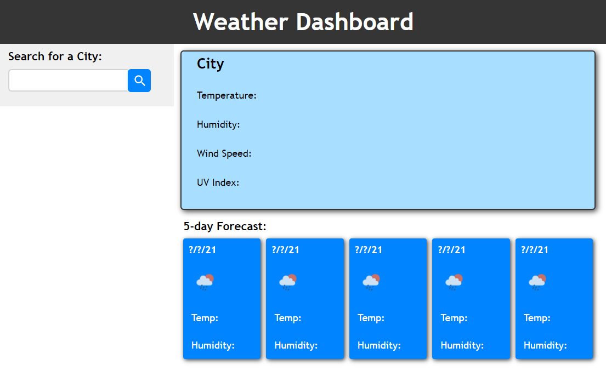

# weather-dash
Weather Dashboard powered by the Open Weather API

## Description

This application gives the user to access current and future weather data for over 200,000 cities around the world in a simple clear format. Upon searching for a city, the dashboard will present the city's name, an icon depicting current weather conditions, as well as the temperature, humidity, and color-coded UV Index. 

The 5-day forecast will display the forecasted date, weather icon, temperature, and humidity. 

I used HTML, CSS, JavaScript, jQuery, and the Open Weather API to build this application.

## Usage

View the deployed page at this link: https://gregriss.github.io/weather-dash/

Upon opening the application for the first time, you will find a page that looks like this: 

To find weather data, type any city into the search bar and click the blue search button. The city's weather data will appear as well as a new button in the light gray column on the left side of the screen. As you search additional cities, your searches are saved for you. To return to a city you've searched before, just click it's corresponding button in the list. 

